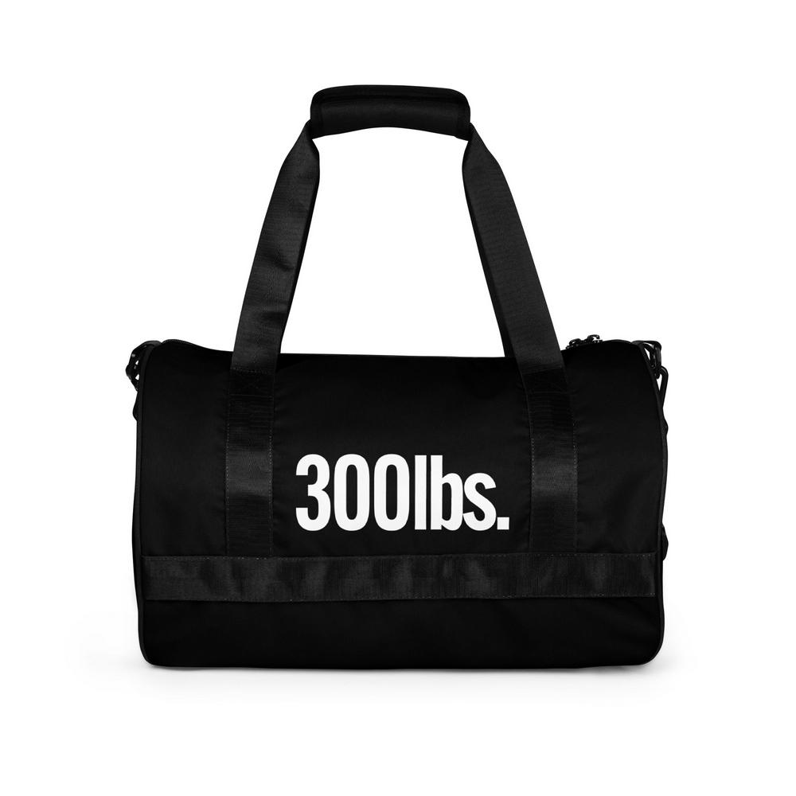

# Auto-Label

### Purpose

- Automate the training of image models 

Provided you have a source of images, this should take care of the rest 

### Current Limitations

- still in early stages of development, this is the definition of whats called "just make it work".


### Current Capabiities

- can download images (1394 in this test)
    - dynamically resize each image by 1/2 or a 1/4 depending on the machine learning model requirements
        - (meaning if a image is downloaded and its '1000 x 1000' it will then be '500 x 500' -- '1200 x 1200' ~> '600 x 600' -- '1120 x 1200' ~> '560 x 600' and so on)
    - query the custom api for image labeling & label each individual image with 5+ labels
    - write each set of labels to a separte .txt (going to be changed to `.jsonl` file) file with the same name as the downloaded image
      all in `> ~/auto-label 3m36s`

```bash
~/auto-label 
❯ ruby label_service.rb                                         
Successfully downloaded /Users/macadelic/pikaso/sync_products/yaml_out/dl_images/all-over-print-case-for-airpods-white-airpods-pro-gen2-front-661829f8dfc1f.jpg
Successfully downloaded /Users/macadelic/pikaso/sync_products/yaml_out/dl_images/all-over-print-case-for-airpods-white-airpods-gen3-back-66182b2b8d8df.jpg
Successfully downloaded /Users/macadelic/pikaso/sync_products/yaml_out/dl_images/all-over-print-case-for-airpods-white-airpods-gen1-left-back-661829f8e0b1f.jpg
Successfully downloaded /Users/macadelic/pikaso/sync_products/yaml_out/dl_images/all-over-print-case-for-airpods-white-airpods-pro-gen2-right-back-661829f8e16d0.jpg
Successfully downloaded /Users/macadelic/pikaso/sync_products/yaml_out/dl_images/all-over-print-case-for-airpods-white-airpods-pro-gen1-left-front-661829f8e1171.jpg
Successfully downloaded /Users/macadelic/pikaso/sync_products/yaml_out/dl_images/all-over-print-case-for-airpods-white-airpods-gen1-front-66182b2b8d284.jpg
......
.......


Successfully downloaded 1394 images


Successfully resized /Users/macadelic/pikaso/sync_products/yaml_out/dl_images/137d9d82c20fffcc4505f3471cc99d91c2c8f680b56a168d369713df61704556.webp
Successfully resized /Users/macadelic/pikaso/sync_products/yaml_out/dl_images/0b6990e2111bbbb544fa265efc72f9f124f8623c00c3d713e1d95d40fe1a357c.webp
Successfully resized /Users/macadelic/pikaso/sync_products/yaml_out/dl_images/0f4b2a98-1dc4-4fc8-9dc5-58ab815e429e.jpg
Successfully resized /Users/macadelic/pikaso/sync_products/yaml_out/dl_images/1b3b109276ef536d3d776a3306bb20c248fd519e9af47741aa6fe49bbd31ca6b.jpg
Successfully resized /Users/macadelic/pikaso/sync_products/yaml_out/dl_images/05aafe33c2ab75f8f4c9ac66b5b8ae20868de664d90d3cce90c051d3b959978a.webp
Successfully resized /Users/macadelic/pikaso/sync_products/yaml_out/dl_images/20e9b92a03f100a83d0144a0b255ac5c2ce4915752f5f14e6487ee040481eed1.webp
Successfully resized /Users/macadelic/pikaso/sync_products/yaml_out/dl_images/1535d3df16c0bfec030f298ed795936a6351aa12b504cb0c07c655f42774a9d4.jpg
Successfully resized /Users/macadelic/pikaso/sync_products/yaml_out/dl_images/1c6c0258b5107c671dd158557f9f8fb0bed88cb235e1516c18a21b1a8f0df6cb.webp
Successfully resized /Users/macadelic/pikaso/sync_products/yaml_out/dl_images/3986fd73ce3c1778d80330ac8d29c9ec79dfdd0b18d94e2a0df1688ff29eecf9.webp
Successfully resized /Users/macadelic/pikaso/sync_products/yaml_out/dl_images/433b77fe624c9978b866dd5fbdeef61ba344c9e64235ba5cb1fe9bc09feb4c57.jpg
.........
..........


Processing complete. Outputs are in /Users/macadelic/pikaso/sync_products/yaml_out/dl_images/labeled

~/auto-label 3m36s 

```




```json
{
  "responses": [
    {
      "labelAnnotations": [
        {
          "description": "Luggage and bags",
          "mid": "/m/0hf58v5",
          "score": 0.91750944,
          "topicality": 0.91750944
        },
        {
          "description": "Bag",
          "mid": "/m/0n5v01m",
          "score": 0.89651096,
          "topicality": 0.89651096
        },
        {
          "description": "Shoulder bag",
          "mid": "/m/0hgrzkp",
          "score": 0.8154142,
          "topicality": 0.8154142
        },
        {
          "description": "Font",
          "mid": "/m/03gq5hm",
          "score": 0.76985645,
          "topicality": 0.76985645
        },
        {
          "description": "Handbag",
          "mid": "/m/080hkjn",
          "score": 0.69733477,
          "topicality": 0.69733477
        },
        {
          "description": "Auto part",
          "mid": "/m/08dz3q",
          "score": 0.694934,
          "topicality": 0.694934
        },
        {
          "description": "Fashion accessory",
          "mid": "/m/0463sg",
          "score": 0.6764675,
          "topicality": 0.6764675
        },
        {
          "description": "Brand",
          "mid": "/m/01cd9",
          "score": 0.6745593,
          "topicality": 0.6745593
        },
        {
          "description": "Strap",
          "mid": "/m/04lzmz",
          "score": 0.6533819,
          "topicality": 0.6533819
        },
        {
          "description": "Rectangle",
          "mid": "/m/0j62f",
          "score": 0.62602776,
          "topicality": 0.62602776
        }
      ]
    }
  ]
}

```

